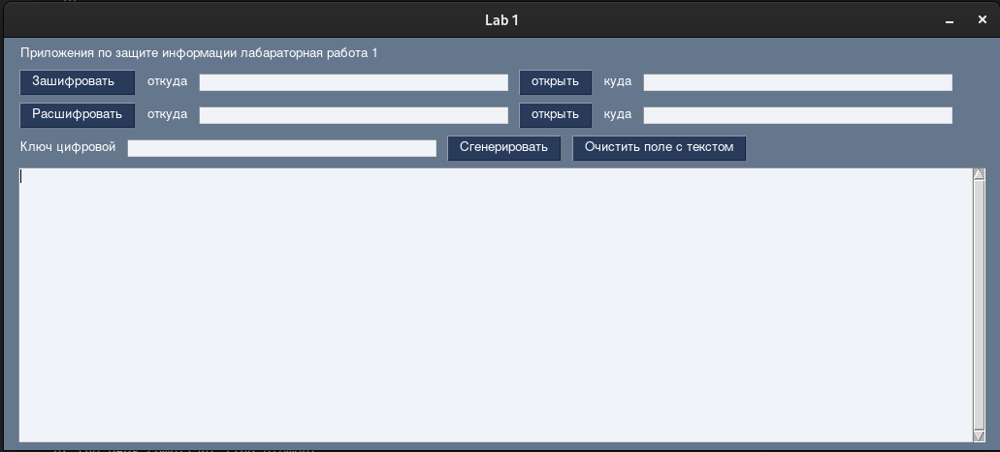

# information-protection-lab-1

[](https://www.codacy.com/gh/GnomGad/information-protection-lab-1/dashboard?utm_source=github.com&utm_medium=referral&utm_content=GnomGad/information-protection-lab-1&utm_campaign=Badge_Grade)

```
Вариант 7. Шифр Гронсфельда с числовым ключом

Лабораторная работа №1
Тема: симметричные криптосистемы.
Цель работы: Разработать криптографическую защиту информации, содержащейся в файле данных, с помощью алгоритма шифрования, указанного в варианте. Для этого:
    1. Разработать алгоритмы шифрования и дешифрования блока (потока) открытого текста заданной длины из алфавита Zn на заданном ключе с помощью метода, указанного в варианте(Если это позволяет алгоритм, длину блока взять кратной 8 бит).
    2. Определить алфавит криптосистемы (открытого текста и шифртекста). Если алфавит не задан в варианте, выбрать его самостоятельно, так, чтобы он включал в себя символы используемого в примере открытого текста. Например, русский, английский, ASCII. Поставить символам исходного алфавита в соответствие символы из алфавита Zn (n – основание алфавита).
    3. Написать программу генерации случайных ключей шифра, оценить размерность ключевого пространства.
    4. Написать програму, реализующую шифрование на заданном ключе открытого текста, состоящего из символов заданного алфавита. Открытый текст, ключ и шифртекст должны быть представлены отдельными файлами.
    5. Написать програму для реализации алгоритма дешифрования полученного файла шифртекста при известном ключе.
    6. Провести тестирование программ
    • на коротких тестовых примерах.
    • на текстах в несколько страниц
```

## Запуск

### Инициализация

```ps
python -m vnev env
```
```ps
.\env\Scripts\Activate.ps1
```
```ps
python -m pip install --upgrade pip
```
```ps
pip install -r .\requirements.txt
```


### Запуск
```ps
python app_gui.py
```



В начале данные обрабатываются из файла, если файл не указан то из поля с низу

Второе поле в каждой строке - это название файла которое будет сгенерированно

Генерация работает только для данных из файла


### Дополнительно

Реализовать консольный интерфейс